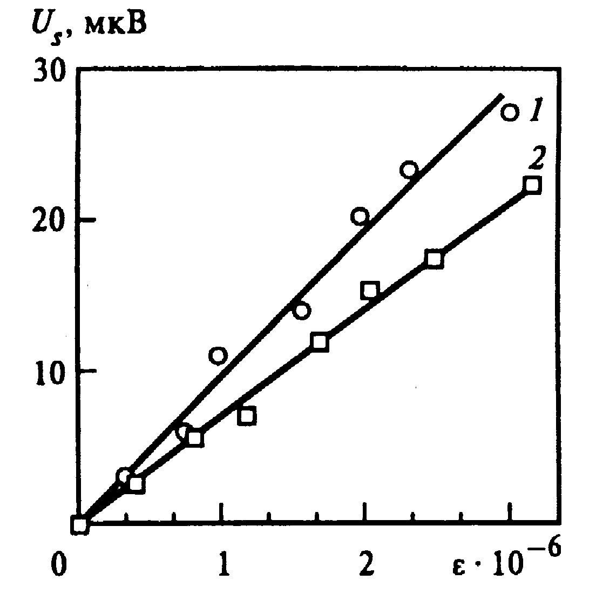

::: {custom-style="1_СпАвторов"}
А.А. Ивова, П.С. Ромов, студенты; рук. Е.С. Янко, к.т.н., доц.  
(РГГУ, Москва)  
:::

::: {custom-style="2_НазвДоклада"}
Пример оформления тезисов докладов 
:::

Оформление «Примера...» моделирует авторский оригинал тезисов. Оно подготовлено с помощью текстового редактора Microsoft Word. 

Одной из важнейших разновидностей электротехнических систем являются системы электроэнергетические. Электроэнергетика нуждается в устройствах измерения тока в нормальных и аварийных режимах. Для этих целей обычно используются электромагнитные трансформаторы тока [@rmd-book].

Альтернативный способ решения проблемы, связанной с погрешностями трансформатора тока, это использование пояса Роговского [@bookdown-book]. Он получает все большее применение в качестве первичных преобразователей для релейной защиты.

Пример насыщения магнитопровода представлен на рис. \@ref(fig:image).
Исследование заключается в построении математических моделей измерительных преобразователя на базе интегратора и пояса Роговского.

::: {custom-style="Frame"}
{width=3.88cm}
:::

Коэффициент диффузии определяется соотношением:

::: {custom-style="DisplayEquation"}
\begin{equation}
f\left(k\right) =\binom{n}{k} p^k\left(1-p\right)^{n k}
(\#eq:binom)
\end{equation}
:::

::: {custom-style="3_ОснТекст_без_абзаца"}
где $n$ и $k$ - целые числа; значение $p$ можно найти в [@bookdown-book]. 
:::

Параметры трансформаторов тока представлены в табл. \@ref(tab:table).

Table: (\#tab:table)  
**Пример оформления таблицы**

| **Режим** | **Q~0~ , МВт** | **D~0~, кг/с** | **N~э~, МВт** | **Q~т~, МВт** | **η~э~, %** | **η~эт~, %** |
|-----------|---------------|---------------|--------------|--------------|------------|--------------|
| 1         | 3195,4        | 1750          | 1091,3       | 0            | 34,75      | -            |
| 2         | 3286,6        | 1800          | 1091,3       | 150          | 35,43      | 37,77        |

Прорабатывается методика экспериментальной оценки погрешности реального измерительного преобразователя.

::: {custom-style="4_СпЛитературы"}
Литература
:::

